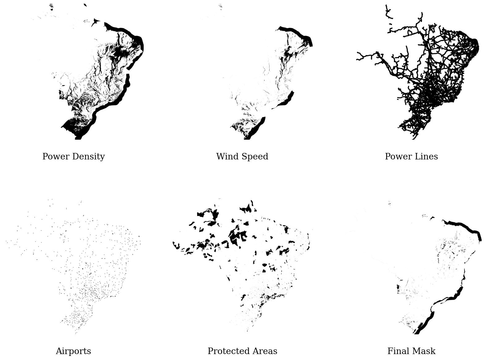

---

title: A Geospatial Exploration of Wind Energy in Brazil

author: Noah Syrkis & Christina Gaitanou

geometry: margin=3cm

fontsize: 12pt

---

  

## Introduction and Goal

  

As climate change threatens the globe, the search for sustainable, low-carbon energy sources becomes more pressing. In this context, wind energy emerges as a front-runner. Wind offers a renewable, non-polluting and inexhaustible supply of electricity. Finding locations for wind farms is a multimodal challenge. Factors include wind patterns, topography, population density, ecological considerations and proximity to existing infrastructure.

Wind energy consists of one of the most promising avenues for addressing the urgent need to transition to more sustainable, low-carbon energy sources. Harnessing the power of the wind provides a renewable, inexhaustible source of electricity that can help mitigate the impacts of climate change while driving economic development. However, the siting of wind farms is a complex task, with numerous geographical, environmental and infrastructure factors to consider. 

Brazil, with its vast territory and diverse climate, presents unique opportunities and challenges for wind farm development. The country is home to a range of ecosystems, from the sprawling Amazon rainforest to the arid Caatinga, each with its own wind patterns and biodiversity considerations. Moreover, Brazil's rapidly expanding electricity grid and growing demand for power add another layer of complexity to the task.

For this project's purposes, we will consider the domain of locations for wind farm installations both on shore and off shore across Brazil, due to the country's strong potential for both.

  

## ) for sustainable wind farm development.

The main objective of this study is to address these challenges through the lens of geospatial data. We are dealing with the modalities to be considered as constrains with datasets that include meteorological, topographical, demographic, ecological and infrastructure data, aiming to identify appropriate areas for wind farm construction in the country of Brazil.

  

  

## Problems and Background

  
Brazil is a country with large renewable energy potential; its large land area and coastline makes it a great candidate for both offshore and on shore wind farm installations @Lucena2019. The country stands out for its successful implementation of wind energy resources and capacity, including the development cost @overcoming_barriers. More specifically, "Brazil has the eighth larger installed wind energy capacity in the world", according to Neilton Fidelis da Silva @utilization_we. Between 2008 and 2017, the capacity grew 37 times nationally and reached 12,770 MW. @overcoming_barriers. Only the Northeast region has reported an average capacity that is much higher than the averages of many countries around the world @overcoming_barriers. Additionally, the generation forecasts are pretty reliable with strong and stable trade winds, that makes the country a suitable region. However, there have been studies on the barriers one has to consider in wind farm constructions in Brazil. Among others, the unstable macroeconomic environment and inadequate access to capital, with the poor transmission infrastructure to be identified as the most impactful ones (regarding on shore wind farms) @overcoming_barriers.

Recognizing the potential of wind energy, Brazil has made significant strides in its development. By 2023, the country ranked third in the world for installed wind capacity, with its wind farms primarily concentrated in the northeastern states. These states offer favorable wind conditions coupled with relatively easy access to the national electricity grid.

Renewable energy development relies on the establishment of effective political efforts and economic interventions @we_brazil, thus the political and economical state of any country directly affect the decisions and constructions regarding energy supply. Brazil has a history of political instability, which makes it difficult to invest in long-term projects. In addition, Brazil is quite polarised politically, with recent administrations being anti-environmentalist. Finally, Brazil has a history of corruption, which makes it difficult to invest in long-term projects; complicated legal systems; and a lack of transparency. 

However, the country is also in many ways on the forefront of environmentalism, having played an important role in the Paris Agreement and having a large renewable energy sector. Al Gore has called Brazil "a leader in the global effort to combat climate change". Alfredo Sirkis, a Brazilian politician and environmentalist, has called Brazil "the most important country in the world for the future of the environment".

It's also worth noting the contribution of the Climate Investment Funds' (CIF) Clean Technology Fund (CTF), which has been instrumental in advancing renewable energy projects, including wind energy, in Brazil. The CTF’s involvement in such initiatives underscores the significant international interest and investment in Brazil’s clean energy sector.

In the following sections, we detail our approach to explore and analize the multiple dimensions of wind farm location feasibility in Brazil, focusing on the key data modalities of meteorology, topography, demography, ecology and infrastructure.

  

## Data Acquisition and Processing

  

Wether a given location is appropriate for a wind farm depends on a variety of factors. Crucial considerations range from proximity to high-voltage power transmission and the terrain's roughness to the overarching meteorological conditions, with a particular focus on wind. Furthermore, the local population density and biodiversity of the region introduces significant constraints. Because these factors all provide necessary insights, the constructed map has to account for the  topography, meteorology, demography, ecology and infrastructure modalities. Creating a truly comprehensive map, would demand resources beyond the scope of this project since Brazil's area is comparable to that of Europe's. Ecology for example, is a multifaceted consideration on biodiversity and all of its complexity, a task that requires significant attention to detail and rigorous data collection methods. Similarly, meteorological data, such as wind speed and direction, must be recorded over extended periods and across seasons to capture temporal fluctuations and trends. Each of these datasets represents a piece of a complex puzzle that must be meticulously assembled to deliver a holistic understanding of the environment's suitability for wind farm development. Having that in mind, this is just an approximate mapping development depending on the data and tools we can acquire and use. However, the criteria and constrains have been selected by researching literature review on similar works. There are also criteria that have not been explored, for example the wind farms that already exist or the highway access because it was a computational intractable. Furthermore, its important to mention that even though Brazil is prone to multiple barriers regarding wind farm construction that this project won't spend time on. Instead, the project aims to be a simplified representation of the commonly enlisted factors that one has to consider and their constrains. 

These are the criteria selected and used  for this project: 

- Meteorology - Wind Speed
- Ecology - Biodiversity 
- Demography - Population Density
- Elevation and slope - Topography
- Power lines and airports - Infrastructure 

This analysis starts with exploring the topographical data  that provide an understanding of the landform characteristics. Then, moving onto meteorological data since it's a key determinant of wind farm feasibility, and followed by the demographical data, which sheds light on the population distribution and its potential impacts. Afterwards, we process the ecological data which guides our understanding of the  essential environmental constrains. Last but not least, we gather the infrastructure data that maps out the proximity to necessary facilities such as power transmission lines. Each of these dataset categories has its own unique contribution to the overall picture of wind farm location, thereby reflecting the multi-dimensionality of this problem.

In the subsequent sections, we will not only describe the nature of the data we have collected for each modality but also detail the specific processing steps that have been undertaken to prepare the data for further analysis and modelling.  

### Meteorology

Meteorological conditions, particularly the wind speed, play an elementary role in determining the feasibility and efficiency of a wind farm. To assess these conditions, we extracted wind data from the Global Wind Atlas (GWA), a comprehensive source of wind resources across the globe. Our extraction specifically targeted Brazil and an additional 100 kilometers off its coast. The data modalities included both wind power density and wind speed.

Wind power density, measured in watts per square meter (W/m²), is an essential parameter to consider as it provides insights into the amount of power that can be harnessed at a given location. Given the extensive area of Brazil and its offshore regions, we applied a percentile limitation on power density data. This method involved eliminating regions that did not fall within the top 20% power density. As a result, the geographical scope was narrowed down to areas with the highest potential for wind energy production. As anticipated, the regions remaining after this process predominantly included the five states identified as having the highest wind farm potential - Bahia and certain southern and northeastern coastal states.

In the offshore regions, wind speed, measured in meters per second (m/s), was the primary variable of interest. Wind speed is a critical factor in the power output of wind turbines, as the energy produced increases exponentially with wind speed. To ensure the viability of offshore wind farms, we selected regions where the wind speed was 7 m/s or higher. This restriction was based on the knowledge that wind speeds lower than this threshold often result in sub-optimal energy production.

This methodological approach allowed us to concentrate on regions demonstrating the highest potential for effective wind energy harvesting. In the following sections, we will further elaborate on how this meteorological data is integrated with other data modalities to comprehensively assess wind farm location feasibility. The resolution of this data is 250m by 250m, raster data.

  

### Demography

// wind turbines might cause issues on building a wind farm close to populated areas. 

The interplay between wind farm development and human habitation is a critical factor in wind farm location planning, making demographic data an integral part of our analysis. To capture this aspect, we relied on population density data sourced from the official Brazilian statistics website. This data was in the form of a raster dataset, which depicted population density across Brazil at a resolution of one square kilometer (km²) per pixel.

  

In the context of wind farm placement, population density serves as a proxy for potential social and environmental impacts. These may include noise disturbances, visual disruption of the landscape and other factors that could affect local communities. Guided by international studies and specific regulations that discourage the construction of wind farms in densely populated areas, we set a threshold of four people per square kilometer. All regions exceeding this threshold were systematically eliminated from our analysis to proactively mitigate potential adverse impacts.

  

Our demographic data was the coarsest raster data incorporated into our study, having dimensions of 4000 by 5000 pixels. The resolution of a raster dataset refers to the area each cell of the grid covers on the ground, with larger cells corresponding to lower resolution. Even though this lower resolution meant potentially less precision, the population density data proved invaluable during the initial development stages. It was used as the reference resolution to which all other data modalities were scaled. This decision was motivated by the need to harmonize the data from different modalities and optimize computational efficiency.

  

However, it's crucial to note that this was an interim measure during the development stage. For the final analysis, we rescaled all data to match the highest resolution dataset available among our data modalities, which was the meteorological data from the Global Wind Atlas. This allowed us to ensure that the granularity of our analysis was not compromised by the initial lower resolution of the demographic data. The specifics of the rescaling process, which ensured compatibility between datasets of varying resolutions, will be further elaborated on in the subsequent sections.

  

### Topography

  

Assessing the topography of potential wind farm sites is crucial as it impacts both the construction feasibility and the wind farm's performance. For our topographical data, we utilized the 'elevation' Python package to generate an elevation map of Brazil. Using this data, we calculated two critical parameters: the slope and the roughness of the terrain.

  

The slope of a site significantly influences the accessibility and ease of construction. Steep slopes may not only make construction challenging but also increase the potential for soil erosion and landslides, thereby necessitating additional environmental considerations. On the other hand, the terrain's roughness affects the wind flow, with rougher surfaces tending to slow down the wind and potentially reduce turbine efficiency.

  

Our topographical data was the highest resolution data in our study, recorded at 3 arc-seconds, translating into a ground resolution of approximately 90 meters at the equator. This fine granularity allowed us to capture detailed variations in the landscape, providing a more nuanced understanding of the terrain's suitability for wind farm placement.

  

However, one challenge encountered during the integration of topographical data with other modalities was the difference in coordinate reference systems (CRS). While our topographical data was projected in a CRS referenced as '3', all other datasets used a CRS referenced as '4'. Coordinate reference systems are crucial in geospatial analysis to ensure all data align correctly on the Earth's surface.

  

To resolve this, we performed a CRS transformation on the topographical data to match the CRS '4' used by the other data modalities. This harmonization was necessary to maintain geographic consistency across all datasets, thereby ensuring the accuracy and reliability of our integrated analysis.

  

The process of transforming the topographical data to match the CRS and resolution of other modalities, while maintaining the integrity and granularity of the data, will be described in more detail in the subsequent sections.

  

### Ecology

  

Ecological considerations, including biodiversity and protected areas, are paramount when planning wind farm locations due to their potential environmental impact. For this facet of our analysis, we obtained data from OpenStreetMap (OSM), specifically the 'brazil.pbf' file, which encompasses a wealth of geographical information about Brazil.

  

Processing this extensive dataset presented a significant computational challenge. Even when utilizing a powerful computing cluster with 90GB RAM, it proved infeasible to handle the data directly with Python due to its size and complexity. To overcome this obstacle, we turned to PostGIS, a spatial database extender for the PostgreSQL relational database. PostGIS excels at managing and processing geospatial data, making it an ideal tool for this task.

  

We executed queries against the OSM data in PostGIS to identify protected areas within Brazil. These queries returned vector data delineating these protected regions. For compatibility with our other modalities, we then transformed this vector data into a raster format. This transformation process facilitates a more streamlined integration with our other raster-based datasets.   

Through this process, we found that approximately 7% of Brazil's territory falls within protected areas. It is worth noting, however, that the measure of protected areas, while useful, may not entirely capture the ecological significance of all regions. Some areas of high biodiversity value might remain unprotected, hence this modality could potentially be enriched with additional biodiversity measures in future iterations of the project.

  

Nevertheless, incorporating this ecological data into our analysis provides a crucial starting point for ensuring that wind farm location planning takes into account environmental conservation objectives. We will describe in subsequent sections how this ecological data was integrated with other data modalities to deliver a comprehensive assessment of wind farm location feasibility.

  

### Infrastructure

  

Infrastructure proximity is a significant factor in wind farm location analysis, given its impact on both construction feasibility and operational efficiency. For our study, we focused on two crucial types of infrastructure: high-voltage power transmission lines (400V and above) and airports. This data was also obtained from the 'brazil.pbf' file in the OpenStreetMap database and PostGIS was used to query and process the data.

  

High-voltage power lines are a critical consideration because a wind farm needs to be connected to the power grid to distribute the electricity it generates. Proximity to existing power lines can significantly reduce the cost and complexity of connecting a wind farm to the grid. Therefore, we queried the database for locations of 400V and above power lines to incorporate this crucial factor into our analysis.

  

Airports were another key consideration due to regulatory restrictions on wind farm locations in proximity to airfields. Wind turbines can interfere with radar systems and create turbulence, posing a potential hazard to aircraft. As such, we included data on airport locations to ensure our recommended locations comply with aviation safety regulations.

  

While we initially intended to also incorporate data on highways—given their role in facilitating access to wind farm sites for construction and maintenance—the size and complexity of the dataset (over a million highways in Brazil) presented computational challenges. Specifically, creating a buffer zone around each highway, which would delineate the area within a specified distance from the highway, proved to be computationally prohibitive, even with our powerful computing cluster.

  

Despite this limitation, the combination of power line and airport data provides a robust basis for assessing the suitability of potential wind farm sites from an infrastructure perspective. In subsequent sections, we will discuss how this infrastructure data was integrated with the other data modalities to perform a comprehensive analysis of wind farm location feasibility in Brazil.

  

  

## Results

  

## Discussion

Most of the works are using a Multi-Criteria Decision Analysis (MCDA), such as the Analytic Hierarchy Process (AHP), which involves scoring the options and weighting the criteria for obtaining a suitable map. However, after discussing with CBC  Brazilian Climate Central (CBC) we decided to develop and deploy an online platform that will allow the user to weight the criteria and choose the desired state. With these inputs the platform will show visualisations of these different constrains and finally output the combined final suitable map. This way, instead of classification and buffer zones, the user will be able to explore in real time the possibilities and limitations of a wind farm construction in Brazil. 

Regarding the minimum and maximum distance from these criteria constrains, literature uses different buffer zones and restrictions according to country regulations and hypotheses. The different kinds of limitations and requirements for a wind farm construction depend on implementation and may vary from state to state. For instance, often the setback distance is a multiple of the total height of the turbine to ensure safety. Since these can be relatively flexible to implementation, it is another reason we decided to leave the option of exploration to the user. 

## Conclusions and Future Work

  

Future work includes adding more modalities and since there are quite a few modalities at play here, the focus would be also be on improving in detail and accuracy of the processing of the existing ones. For example, we only very late found out that not all 400 voltage cables were in operation.  

  

Other modalities that merits exploration is also political and economic viability. This depends on the envisagined user of our system, Copenhagen Infrastucture Partners and Centro Brazil No Clima.

  

## References

  

  

## Appendix

  

  

| Hemisphere | $\alpha$ correlation | $\beta$ correlation |

|------------|---------------------:|--------------------:|

| Left       | 0.063                | - 0.147             |

| Right      | 0.076                | - 0.087             |

  

Table: Bayesian Hyperparameter Sweep (Model 1).

  

  

| Hemisphere | $\alpha$ correlation | $\beta$ correlation |

|------------|---------------------:|--------------------:|

| Left       | 0.063                | - 0.147             |

| Right      | 0.076                | - 0.087             |

  

Table: Bayesian Hyperparameter Sweep (Model 1).